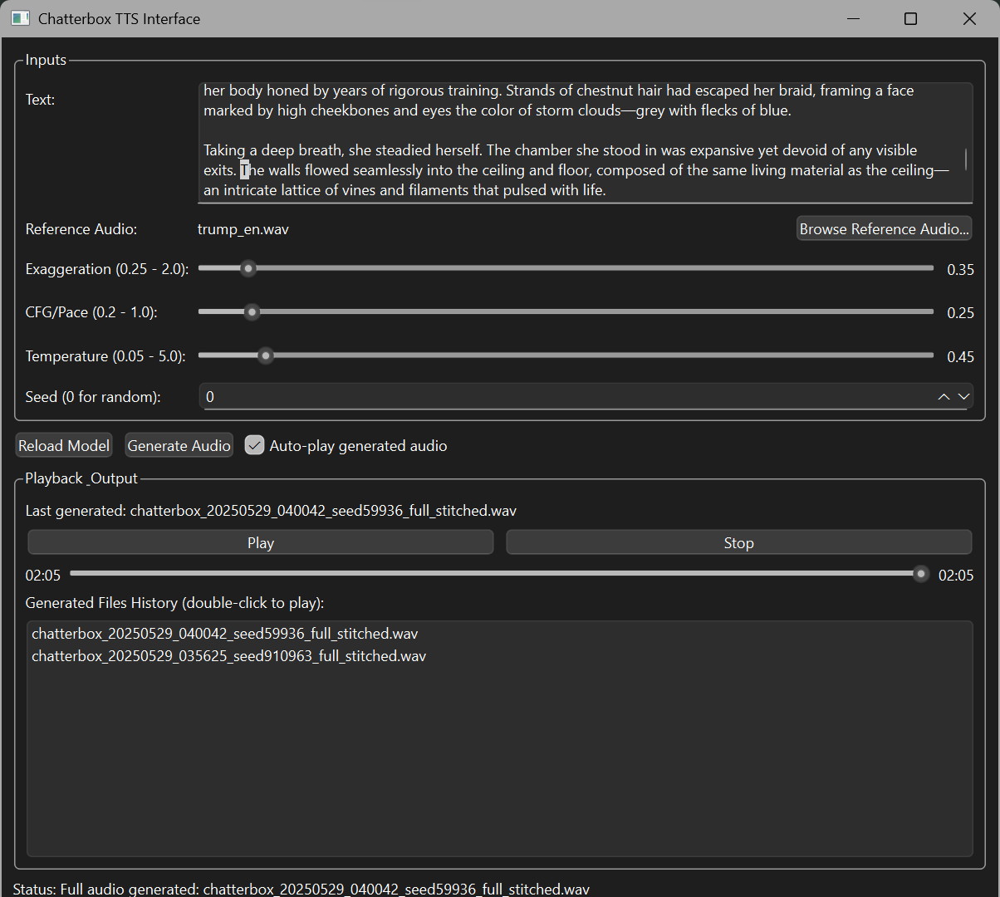

# Chatterbox TTS - One Click Installer & UI

This project provides a user-friendly PySide6 interface for Resemble AI's open-source **Chatterbox TTS** model, along with a one-click (Windows `run.bat`) (Mac OS `run.sh`) installer to set up the environment and dependencies.


## Table of Contents

* [Features](#features)
* [Language Support](#language-support)
* [Prerequisites](#prerequisites)
* [Installation & Usage](#installation--usage)
* [Manual Installation (Advanced)](#manual-installation-advanced)
* [Project Structure](#project-structure)
* [Troubleshooting](#troubleshooting)
* [Important Notes on PyTorch Installation](#important-notes-on-pytorch-installation--reproducibility)
* [Contributing](#contributing)
* [Acknowledgements](#acknowledgements)

## Screenshot

<details>
<summary><strong> Check this beautiful UI </strong>- Click to expand</summary>


*(Early Stage of the App UI)*
</details>

## Language Support

<details>
<summary><strong>Official Model Capabilities (v0.1.1)</strong> - Click to Expand</summary>

*   The underlying `chatterbox-tts` model (version 0.1.1, as currently used by this project) is primarily designed and trained for **English (US/General Accent)** text-to-speech.
*   **Other Languages:**
    *   While the model may attempt to pronounce words from other languages using English phonetics, the results will generally **not sound like native speech** and may be heavily accented or unintelligible.
    *   Languages using **non-Latin scripts** (e.g., Greek, Cyrillic, Chinese, Korean, Arabic, Hindi) or those with extensive **diacritics/special characters** not common in English are highly likely to cause errors (including potential CUDA errors if character processing fails) or produce completely garbled output.
*   **Achieving True Multilingual Support:** This would require:
    *   New models or updated versions from the `chatterbox-tts` **developers** specifically trained or fine-tuned for those languages.
    *   Community efforts to **fine-tune** the existing model or train new ones on specific language datasets.
*   **Recommendation:** For reliable and high-quality results, **it is strongly recommended to use English text only** with the current version of the model. It is primarily a research and development tool for English TTS at this stage.
</details>

<details>
<summary><strong>Community Language Test Observations (Unofficial)</strong> - Click to Expand</summary>

The following are informal observations on how the current English model (v0.1.1) attempts to handle text from other languages. These are **not endorsements of support** but rather notes on its behavior. Expect a strong English phonetic base and accent.

**⚠️ WARNING: Non-Latin Scripts & Extensive Diacritics ⚠️**
Attempting to process languages with non-Latin scripts (e.g., Greek, Cyrillic, Hanzi, Hangul) or extensive diacritics can lead to unpredictable behavior, including application errors (like CUDA device-side asserts with Greek text) or completely garbled/silent output. **Proceed with caution and expect instability if testing these.**

*   **English:** ✅ Supported (Primary Language)
*   **German:** 🗣️ Produces heavily English-accented speech. Does not sound like native German.
*   **French:** 🗣️ Produces heavily English-accented speech.
*   **Spanish:** 🗣️ Produces heavily English-accented speech.
*   **Italian:** 🗣️ Produces heavily English-accented speech.
*   **Romanian:** 🗣️ Produces heavily English-accented speech.
*   **Dutch:** 🚫 Generally unintelligible or sounds nothing like Dutch.
*   **Swedish:** 🚫 Generally unintelligible or sounds nothing like Swedish.
*   **Polish:** *(Latin script with diacritics)* - 🗣️ Likely heavily English-accented; intelligibility may vary. *(You can update with your specific test result here if you do one, e.g., "Poor intelligibility, strong English accent.")*
*   **Turkish:** *(Latin script with some unique characters)* - 🚫 Generally unintelligible or heavily English-ified.
*   **Czech:** *(Latin script with diacritics)* - 🗣️ Likely heavily English-accented; intelligibility may vary. *(Update with test result)*
*   **Bulgarian:** *(Cyrillic script)* - 🛑 **HIGHLY UNSUPPORTED.**
*   **Russian, Serbian, Ukrainian (other Cyrillic):** 🛑 **HIGHLY UNSUPPORTED.**
*   **Korean (Hangul):** 🛑 **HIGHLY UNSUPPORTED.** May attempt to pronounce characters as English letters.
*   **Chinese (Mandarin - Hanzi):** 🛑 **HIGHLY UNSUPPORTED.** May attempt to pronounce characters as English letters or Pinyin with English phonetics.
*   **Greek (Greek script):** 🛑 **HIGHLY UNSUPPORTED & POTENTIALLY UNSTABLE.** Can lead to application errors (CUDA asserts).

*(This list is not exhaustive. Feel free to report your findings for other languages if you experiment, but please note the model's English-centric design.)*
</details>

## Features

<details>
<summary>Click to expand</summary>

*   **Simple PySide6 Interface:**
    *   Text input for speech synthesis.
    *   Load reference audio files (`.wav`, `.mp3`, `.flac`) for voice cloning.
    *   Adjustable parameters:
        *   Exaggeration
        *   CFG/Pace
        *   Temperature
        *   Random Seed (0 for random)
    *   Audio playback controls (Play/Pause/Resume, Stop, Seekable Playhead).
    *   History of generated audio files with double-click to play.
    *   Status updates for model loading, generation,  playback and time elapsed.
    *   Option to auto-play audio after generation.
*   **Smart Text Chunking:**
    *   Utilizes NLTK for sentence tokenization.
    *   Long sentences are intelligently split at spaces to avoid cutting words, ensuring better quality for stitched audio.
    *   Handles long text inputs by generating and stitching audio chunks.
*   **One-Click Installer (`run.bat` for Windows):**
    *   Uses `uv` (a fast Python package installer and resolver) for environment setup.
    *   Automatically creates a Python virtual environment (`.venv`).
    *   Installs all necessary dependencies from a lock file (`requirements.lock.txt`) for reproducibility.
    *   Detects your CUDA version (if NVIDIA GPU is present) and installs the appropriate PyTorch build (including torchvision and torchaudio) for GPU acceleration. Falls back to CPU if CUDA is not found.
    *   Downloads necessary NLTK resources (`punkt` for sentence tokenization).
*   **Output Management:**
    *   Saves generated audio to a `chatterbox_outputs` subdirectory.
    *   Filenames include timestamps and the actual seed used for generation.

</details>

## Prerequisites

<details>
<summary>Click to expand</summary>

1.  **Python:** Version 3.11 is recommended and targeted by the `run.bat` script. Other Python 3.8+ versions might work but ensure it's added to your system PATH.
    *   You can modify the Python version in `run.bat` if needed (variable `PYTHON_VERSION`, though currently it uses `python3.11` directly in the `uv venv` command).
2.  **`uv`:** This ultra-fast Python package manager.
    *   Installation instructions: [https://github.com/astral-sh/uv#installation](https://github.com/astral-sh/uv#installation)
3.  **FFmpeg:** Required by Qt Multimedia for playing various audio formats (including the generated `.wav` files).
    *   Download FFmpeg from [https://ffmpeg.org/download.html](https://ffmpeg.org/download.html).
    *   Extract it and **add the `bin` directory (containing `ffmpeg.exe`, `ffplay.exe`, `ffprobe.exe`) to your system's PATH environment variable.**
4.  **NVIDIA GPU (Optional, for GPU acceleration):**
    *   If you have an NVIDIA GPU, ensure you have the latest drivers installed. The installer will attempt to detect your CUDA version.
5.  **Internet Connection:** Required for downloading dependencies during the first setup.
</details>

## Installation & Usage

<details>
<summary>Click to expand</summary>

1.  **Clone or Download this Repository:**
    ```bash
    git clone https://github.com/actepukc/chatterbox-tts-ui
    cd chatterbox-tts-ui
    ```
    Or download the ZIP and extract it.
    (Remove the screenshot or print it as a memory)
2.  **Run the Installer:**
    *   Simply double-click `run.bat`.
    *   This script will:
        *   Check for Python and `uv`.
        *   Create a virtual environment in a folder named `.venv`.
        *   Install all Python dependencies using `uv pip sync` from `requirements.lock.txt`.
        *   Run `install_torch.py` to install the correct PyTorch version for your system (CUDA or CPU).
        *   Launch the `main.py` application.

    *   The first time setup might take a few minutes depending on your internet speed, especially for downloading PyTorch and other dependencies. Subsequent launches will be much faster.

3.  **Using the Application (`main.py`):**
    *   **Load Model:** The model attempts to load automatically on startup. You can use the "Reload Model" button if needed. Status bar will indicate progress.
    *   **Enter Text:** Type or paste the text you want to synthesize. Long texts will be automatically chunked and stitched.
    *   **Reference Audio (Optional):** Click "Browse Reference Audio..." to select a `.wav`, `.mp3`, or `.flac` file to clone its voice characteristics.
    *   **Adjust Parameters:** Use the sliders and seed input to fine-tune the output.
        *   **CFG/Pace:** Lower values (e.g., 0.2-0.4) can slow down speech and improve pacing.
        *   **Exaggeration:** Default 0.5 is usually good. Higher values can be more expressive but also faster.
    *   **Generate Audio:** Click "Generate Audio". The status bar will show progress if the text is split into multiple chunks.
    *   **Playback:**
        *   If "Auto-play" is checked, audio plays automatically.
        *   Use the Play/Pause, Stop, and seek slider.
        *   Double-click files in the "Generated Files History" to play them.
    *   Generated files are saved in the `chatterbox_outputs` folder.
</details>

## Manual Installation (Advanced)
<details>
<summary>Click to expand</summary>

### macOS / Apple Silicon (M1/M2/M3) Users:

*   The application includes logic to detect and attempt to use MPS (Metal Performance Shaders) for GPU acceleration on Apple Silicon Macs if a compatible PyTorch version is installed.
*   To enable this, ensure you install a PyTorch build with MPS support. For most users on Apple Silicon, running `uv pip install torch torchvision torchaudio` within the activated virtual environment (after other dependencies) should install a compatible version.
*   **Current Status of MPS in `chatterbox-tts`:** The level of official MPS support within the `chatterbox-tts` library (version `0.1.1`, which this project currently uses) is not fully confirmed by its developers. While this UI attempts to enable MPS, successful GPU acceleration on macOS depends on the library's internal compatibility. If you encounter issues or it seems to be running on CPU, it may be due to limitations in the current `chatterbox-tts` version's MPS support. Future updates to the `chatterbox-tts` library may improve this.
*   The `run.sh` script will likely install a CPU-only version of PyTorch by default via `install_torch.py` (which is CUDA-focused). Manual PyTorch installation is recommended for MPS.
If you prefer not to use the `run.bat` script or are on a different OS:

1.  Ensure **Python 3.11** (or compatible) and **`uv`** are installed and in your PATH.
2.  Ensure **FFmpeg** is installed and its `bin` directory is in your PATH.
3.  Open a terminal in the project directory.
4.  Create and activate a virtual environment:
    ```bash
    uv venv .venv --python 3.11 
    # On Windows:
    .\.venv\Scripts\activate
    # On macOS/Linux:
    source .venv/bin/activate
    ```
5.  Install dependencies from the lock file:
    ```bash
    uv pip sync requirements.lock.txt
    ```
6.  Install the correct PyTorch version:
    ```bash
    python install_torch.py
    ```
7.  Run the application:
    ```bash
    python main.py
    ```
</details>

## Project Structure
<details>
<summary>Click to expand</summary>

*   `main.py`: The main PySide6 application script.
*   `run.bat`: Windows batch script for one-click setup and launch.
*   `run.sh`: MacOS/Linux batch script for one-click setup and launch.
*   `requirements.in`: High-level list of direct Python dependencies.
*   `requirements.lock.txt`: Fully resolved list of all Python dependencies with pinned versions for reproducible environments (generated by `uv pip compile`).
*   `install_torch.py`: Python script to detect CUDA and install the appropriate PyTorch build.
*   `chatterbox_outputs/`: Directory where generated audio files are saved (created automatically).
*   `.venv/`: Python virtual environment (created automatically by `run.bat` or manually).
</details>

## Troubleshooting
<details>
<summary>Click to expand</summary>


*   **`NLTK 'punkt' resource failed to download`**: Ensure you have an active internet connection during the first run. You can also try manually downloading it:
    ```bash
    # Activate your .venv first
    python -m nltk.downloader punkt
    python -m nltk.downloader punkt_tab
    ```
*   **`ChatterboxTTS library not found`**: Ensure `uv pip sync requirements.lock.txt` completed successfully.
*   **No audio playback / Media Player Errors**: Make sure FFmpeg is correctly installed and its `bin` directory is in your system's PATH.
*   **Slow Generation**: Generating speech for long texts by stitching multiple chunks will take time. The number of chunks depends on the text length and sentence structure. Experiment with the `CFG/Pace` and `Exaggeration` sliders for speech rate.
</details>

## Important Notes on PyTorch Installation & Reproducibility
<details>
<summary>Click to expand</summary>

This project aims for both ease of use and reproducible environments. Here's how PyTorch (a core dependency for `chatterbox-tts`) is handled:

1.  **Dependency Locking (`requirements.lock.txt`):**
    *   We use `uv` (a fast Python package manager) and a `requirements.lock.txt` file. This file is generated by the command `uv pip compile requirements.in -o requirements.lock.txt`.
    *   It pins the versions of most dependencies (like `PySide6`, `nltk`, `chatterbox-tts`, and its non-PyTorch sub-dependencies) to ensure that everyone gets the same versions that were tested with this UI.
    *   For PyTorch itself, `chatterbox-tts` requires a specific version (e.g., `torch==2.6.0`). The `requirements.lock.txt` file will include an entry for this version of PyTorch. When `uv pip sync requirements.lock.txt` runs as part of the setup, it will install this locked version, which is typically a general-purpose build (e.g., CPU-only or a base CUDA version if available on PyPI).

2.  **Hardware-Specific PyTorch Build (`install_torch.py`):**
    *   After the initial dependencies are synced from `requirements.lock.txt`, the `run.bat` script (or manual setup) executes `python install_torch.py`.
    *   This specialized script:
        *   Detects if you have an NVIDIA GPU and your CUDA version.
        *   Constructs the correct command to install a PyTorch build optimized for your specific hardware (e.g., a CUDA 12.8 nightly build, a CUDA 11.8 stable build, or a CPU-only build).
        *   This step will **re-install or upgrade** the PyTorch components to ensure you have the best performing version for your system. This might look like PyTorch is being installed twice, but it's a necessary step to get the right build.

**What this means for you:**

*   **Users with NVIDIA GPUs:** The `install_torch.py` script will attempt to provide you with a CUDA-accelerated PyTorch. The `run.bat` script should handle this automatically.
*   **Users on CPU-only systems:** `install_torch.py` will install a CPU-only version of PyTorch.
*   **Users with different CUDA versions than the primary developer:** `install_torch.py` will attempt to install the correct PyTorch for *your* detected CUDA version (e.g., if you have CUDA 11.8, it will target a PyTorch build for CUDA 11.8).
*   **macOS (Apple Silicon/MPS) Users:** The `install_torch.py` script is currently CUDA-focused. For MPS acceleration, you will likely need to manually install a suitable PyTorch version (e.g., `uv pip install torch torchvision torchaudio` in the activated `.venv`) *after* `uv pip sync requirements.lock.txt` and *before* running `main.py`. The `ModelLoaderThread` in `main.py` includes logic to attempt to use the "mps" device if a compatible PyTorch is present.

**Key takeaway:** The `requirements.lock.txt` provides a stable base for most packages. The `install_torch.py` script then tailors the PyTorch installation to your specific hardware for optimal performance. You generally do not need to modify `requirements.lock.txt` manually regarding PyTorch.

</details>

## Contributing

Feel free to open issues or suggest improvements!
## Acknowledgements

*   **Resemble AI** for the open-source [Chatterbox TTS model](https://github.com/resemble-ai/chatterbox).
*   The developers of PySide6, NLTK, PyTorch, and `uv`.# Chatterbox TTS - One Click Installer & UI
